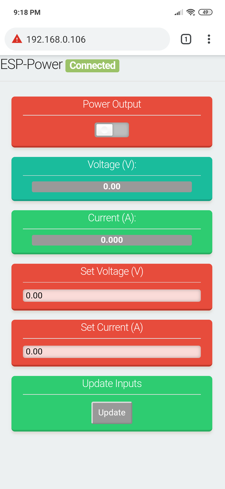
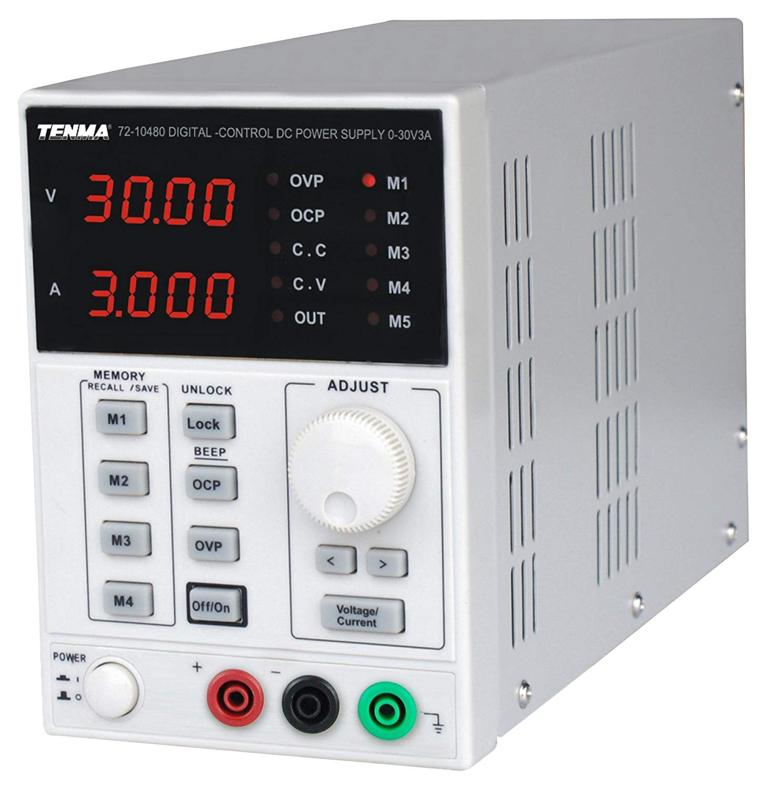
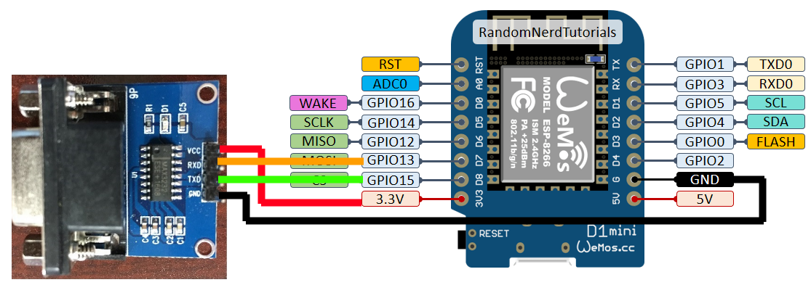

# ESP-Power
This project creates a webserver on a ESP8266 that can be used to control a Tenma / Korad / Other clone power supplies.



## Config
If you want the ESP to connect to a WiFi network rather than creating a hotspot. Remove the #define USE_HOTSPOT from the code. 
You must also create a WiFiSettings.h that matches the WiFiSettings.h.template

The RS232 adaptor uses the following pinout. (Swap the TX / RX pins based on your adaptor)

# License

Shoutout to https://github.com/s00500/ESPUI for doing the heavy lifting for the website

